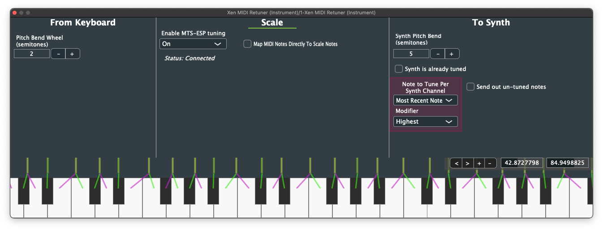

# Xen MIDI Retuner

Xen MIDI Retuner is a novel way for musicians to begin easily experimenting with the complex intervals of microtonal and xenharmonic music.



It is a MIDI plugin that retunes MIDI input to microtonal and xenharmonic scales via clever midi note and pitch-bend output. Xen MIDI Retuner uses the MIDI standard retuning midi notes using pitch-bend to achieve the frequencies defined by a scale. If a synthesizer/DAW can take in note and pitch-bend MIDI messages, with Xen MIDI Retuner, by proxy, the synthesizer/DAW now supports tuning.

Currently tuning information is loaded into Xen MIDI Retuner using ODDSound's MTS-ESP. Therefore a MTS-ESP host, like the free ["MTS-ESP Mini" by ODDSound](https://oddsound.com/mtsespmini.php), is required.

## Readme Table of Contents

- [Xen MIDI Retuner](#xen-midi-retuner)
  - [Readme Table of Contents](#readme-table-of-contents)
  - [Motivation](#motivation)
  - [Setup Process](#setup-process)
    - [Download](#download)
    - [Install](#install)
    - [Setup](#setup)
  - [How To Use](#how-to-use)
    - [Keyboard Navigation](#keyboard-navigation)
    - [Pitchbend Limitation Workarounds](#pitchbend-limitation-workarounds)
      - ["Note to Tune Per Synth Channel"](#-note-to-tune-per-synth-channel-)
      - ["Synth is already tuned"](#-synth-is-already-tuned-)
  - [License](#license)
  - [Contribution](#contribution)
    - [Compiling](#compiling)
    - [Projucer Dependency](#projucer-dependency)
    - [Contribution Conclusion](#contribution-conclusion)

## Motivation

Creating microtonal and xenharmonic music has typically been accomplished by loading tuning/scale files (.scl, .kbm, and/or .tun) or Midi Tuning Standard (MTS) SysEx messages into one's favorite synthesizer or DAW. Unfortunately, many synthesizers and DAWs (Ableton) do not support these retuning file formats.

Xen MIDI Retuner sends the synthesizer notes and pitchbend to allow any digital synthesizer to achieve tuning. Unfortunately with our current version of MIDI pitchbend cannot be applied to individual notes, so only one note can be tuned in a DAW only supporting one MIDI channel per track (see section [Pitchbend Limitation Workarounds](#pitchbend-limitation-workarounds)).

Xen MIDI Retuner additionally functions as a novel way for musicians to begin easily experimenting with the complex intervals of microtonal and xenharmonic music.

Synthesizers with tuning/scale file support maps each MIDI note (each keyboard key) directly to scale note. Therefore, if one is using an octave scale with only 7 notes in it (i.e. 7 EDO), playing a tritone (A + D#) on one's keyboard results in hearing an octave. Pianists who have practiced for years associating the feeling playing an octave on a keyboard with hearing an octave would have to re-learn their association for specific scales.

Xen MIDI Retuner removes this barrier of entry by mapping the closest scale frequency to the nearest 12-tone equal temperament MIDI notes. As a byproduct of this mapping, playing an octave results in hearing the closest interval to an octave in the scale.

## Setup Process

### Download

Find your DAW in the list below and take note of the **Recommended Download Version**.

If your DAW is not listed, continue onward in the guide.

| DAW     | VST2 |    VST2 MIDI Effect     | AU (macOS Only) |         AU MIDI Effect          | Route MIDI input to Instrument<sup>+</sup> plugin | Route MIDI output from Instrument plugin | Recommended Download Version |
| ------- | :--: | :---------------------: | :-------------: | :-----------------------------: | :-----------------------------------------------: | :--------------------------------------: | :--------------------------: |
| Ableton |  ✓   | ✓ (Loads as Instrument) |        ✓        | Plugin does not show in browser |                         ✓                         |                    ✓                     |       VST2 Instrument        |
| Logic   |      |                         |        ✓        |                ✓                |                         ✓                         |                                          |        AU MIDI Effect        |

<sup>+</sup> _Instrument (a.k.a. Synth) plugins are defined as a plugin with MIDI input and Audio output. Some DAWs support being able to route the MIDI output from Instrument plugins._

Head to GitHub's Releases tab to be presented with options of downloading Xen MIDI Retuner ([click here to head to Releases](https://github.com/zardini123/Xen-MIDI-Retuner/releases)). Navigate slightly downward to find an Assets tab filled with hyperlinks. Each hyperlink is a different download version of Xen MIDI Retuner.

First locate the downloads made for your operating system (macOS, Windows).

Second, If your DAW was listed in the earlier step, find the download that has your **Recommended Download Version** in its name. Download that version for your operating system. If your DAW was not listed, download _every variant for your operating system and install each._ This is critical for Setup.

### Install

Plugin installation is unfortunately manual currently. Installation, for us, is simply moving the plugin to a system-specific directory. For each operating system, here is the file path to place the plugin:

- **macOS**: Using Finder, navigate in the toolbar to "Go" > "Go to Folder..."" and paste `/Library/Audio/Plug-Ins`. Copy the VST2 version into the `VST` folder, and the AU version into `Components`.
- **Windows**: Using File Explorer, navigate to any of the following folders. It's recommended to see where your DAW looks for plugins before trying randomly one from the list. Copy the plugin into the one you figure out.
  - `C:\Program Files\VSTPlugins`
  - `C:\Program Files\Steinberg\VSTPlugins`
  - `C:\Program Files\Common Files\VST2`
  - `C:\Program Files\Common Files\Steinberg\VST2`

### Setup

The main crux of the setup is the wildy different setup procedure the DAW needs to configured to route Xen MIDI Retuner's MIDI output to a synth's MIDI input. Some DAW's properly support MIDI effect plugins (i.e. Logic), whereas some load the MIDI plugin as a instrument with no sound (i.e. Ableton).

Eventually I wish to have a guide in this GitHub explaining how in every major DAW to set up the plugin. Here is the current DAW guides:

| DAW                                            |
| ---------------------------------------------- |
| [Ableton](docs/setup/Ableton/Ableton-setup.md) |

If your DAW is not on the list unfotunately it is up to you to figure out how to see if your DAW supports MIDI effects (and therefore use the MIDI effect version of Xen MIDI Retuner). If your DAW does not support MIDI effects properly, it is also up to you to figure out how to route the MIDI from Xen MIDI Retuner to your synth.

Please use the Ableton guide as inspiration. If you do figure out how to do it, feel free to contribute a guide/solution via GitHub issues (users) or pull requests (developers)!

Once you have figured out MIDI effect plugins and MIDI routing in your DAW, download the tuning host ["MTS-ESP Mini" by ODDSound](https://oddsound.com/mtsespmini.php) to be able to load scale files into Xen MIDI Retuner. This is required currently as Xen MIDI Retuner currently only supports the MTS-ESP tuning API for acquiring tuning information. You do not need MTS-ESP Mini if you already have a MTS-ESP host installed.

You can quickly start experimenting with different scales by downloading Sevish's Tuning Packs ([page link](https://sevish.com/music-resources/), [direct download](https://sevish.com/musicmakingstuff/sevish-tunings-pack-v1.1.zip)), or creating your own tuning files online with [Sevish's Workshop](https://sevish.com/scaleworkshop/). These tuning files can be loaded into Xen MIDI Retuner via the tuning host MTS-ESP Mini as mentioned above.

## How To Use

Set "_Synth Pitch Bend (semitones)_" to the ptich bend range of your synthesizer that Xen MIDI Retuner is playing to.

"_Enable MTS-ESP tuning_" must be set to "On". If a MTS-ESP host is found, "_Status: Connected_" will be displayed and tuning will show in the keyboard view.

Currently input pitchbend still needs to be implemented, so "_Pitch Bend Wheel (semitones)_" does not do anything.

### Keyboard Navigation

Right click and drag to slide the keyboard around. Scroll to zoom in and out. Otherwise, one can move the keyboard with the buttons and number fields on the right.

### Pitchbend Limitation Workarounds

Not every note can be tuned when using pitchbend. This is due to limitations of the original MIDI standards. To work with or around that limitation, the following is possible.

#### "Note to Tune Per Synth Channel"

You can choose the note that is retuned per channel using the "_Note to Tune Per Synth Channel_" option.

#### "Synth is already tuned"

If the instrument Xen MIDI Retuner is playing to a synth that is tunable using Scale files or MTS, tune it to the same scale as Xen MIDI Retuner. Then enable "_Synth is already tuned_." Now polyphonic retuning on one channel is possible with Xen MIDI Retuner's clever mapping techniques!

## License

AnaMark tuning library is under the MIT license. This project currently makes no modifications to that source.

Xen MIDI Retuner's original code is licensed under GNU General Public License v3.0. See file LICENSE.md for more details.

## Contribution

### Compiling

This plugin uses [JUCE](https://juce.com/get-juce/download) and the `api_redesign` branch of [AnaMark Tuning Library](https://github.com/zardini123/AnaMark-Tuning-Library/tree/api_redesign). JUCE and AnaMark Tuning Library are included as git submodules in the `lib/` directory.

Initialize the submodules using this in the project's root directory:

`git submodule update --init --recursive`

As of currently, VST.2x is used over VST.3x as I have not had enough time to research the effort required to make the conversion. VST.3x specifications for MIDI CC and Pitch-bend output is much, _much_ different than VST.2x (see this: [Add support for sending Midi CCs out of VST3 plugins](https://forum.juce.com/t/add-support-for-sending-midi-ccs-out-of-vst3-plugins/35781)). Eventually the plugin will be written for exclusive VST.3x support only.

To compile the plugin now, the VST.2x SDK is required. VST.2x SDK is not included in JUCE anymore. The last JUCE commit that had the VST.2x SDK embedded in it can be found [here](https://github.com/juce-framework/JUCE/tree/8317738112ccceb2c58deac3e4bb167c62682916/modules/juce_audio_processors/format_types/VST3_SDK). Download the entire commit ([direct download](https://github.com/juce-framework/JUCE/archive/8317738112ccceb2c58deac3e4bb167c62682916.zip)), extract folder VST3*SDK (located at `modules/juce_audio_processors/format_types/VST3_SDK`) out of the archive, and move the VST3_SDK folder to somewhere you can locate later. \_Note* it says VST3, but it contains the VST.2x SDK code.

CMake needs to know of the location of your VST.2x SDK, so we need to set a global (i.e. absolute) path to it. This is done when preparing the build next.

Prepare the build by running this command in the root folder of this project:

`cmake -B build -D JUCE_GLOBAL_VST2_SDK_PATH=<path to VST3_SDK folder>`

CMake uses the instance of JUCE in the `lib/` directory. If the submodule was not initialized, the plugin will fail to compile.

**Notice:** Make sure _JUCE_GLOBAL_VST2_SDK_PATH_ is the path to your VST3_SDK folder as mentioned earlier.

After preparing the build, run this command:

`cmake --build build --config Release -j 8`

**Notice:** Option `-j` sets number of threads to use for compiling. Usually set this number to the number of cores your computer has.

This will now build the plugins for your operating system. The plugins will automatically installed to the default path for plugins for your system. JUCE will print the path to the automatically installed plugins at the end of the plugin compilation.

If you want to install the plugins to a custom location, the compiled plugins are under `build/midi_plugin_artefacts/` and `build/synth_plugin_artefacts/`.

### Projucer Dependency

Projucer is primarily used for quick and easy prototyping of the user interface with the what-you-see-is-what-you-get (WYSIWYG) GUI editor. To keep the Projucer file (_.jucer_ in root directory of project) in sync with development changes, ensure the following is done in Projucer:

- Creating/adding files or new components
- Deleting files
- Modifying GUI of Projcer-created components

Projucer is not used for compiling in this project.

As Projucer makes automated changes to components using the GUI editor, any additions to those components must be done in dedicated areas of the Projucer files. Any removals must be done through the GUI editor. If not, your changes will be lost when someone updates some layout in a GUI component.

Projucer is not provided pre-compiled in the JUCE repository found in `lib/`. You can either download Projucer via the JUCE website, or preferably you can compile it using your included submodule. Navigate to `/lib/JUCE/` and run the following:

```
cmake . -B cmake-build -DJUCE_BUILD_EXAMPLES=OFF -DJUCE_BUILD_EXTRAS=ON
cmake --build cmake-build --target Projucer
```

Your built Projucer is located from the JUCE path at `cmake-build/extras/Projucer/Projucer_artefacts`. Open Projucer, go to "Tools" and enable "GUI Editor Enabled". You can create a symlink/alias to your Applications folder (macOS) or to your desktop (Windows) to have a quick way to access Projucer next to your IDE.

### Contribution Conclusion

If you make any changes to the source that enhances this plugin, or can be benifical for others, please provide a pull request!

Many scale-related features planned for Xen MIDI Retuner are actually [AnaMark Tuning Library](https://github.com/zardini123/AnaMark-Tuning-Library) related features. If you are interested in the development of the following features, please consider looking at the AnaMark Tuning Library GitHub page.

- .scl and .kbm scale file support
- Scale Editor (modify AnaMark scale dynamically)
- Exposing scale information as editable parameters
- Export / import Sevish Workshop url
- Tuning modified in realtime using the MTS protocol (see MTS (MIDI Tuning Standard) section [here](https://www.midi.org/articles-old/microtuning-and-alternative-intonation-systems), though sysex support is DAW dependent)
- [Other tuning files](https://hpi.zentral.zone/filetypes)
