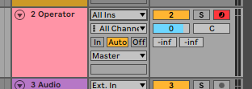
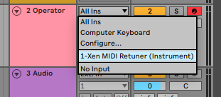
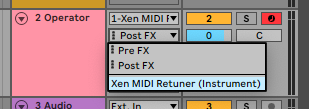
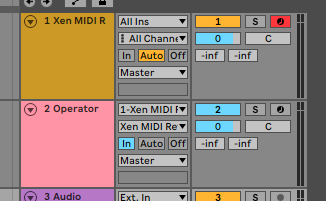

# Ableton Setup (Xen MIDI Retuner)

1. Drag Xen MIDI Retuner from Plugin category to a _new_ track. The plugin will load as an instrument no audio output.
2. Find the MIDI track you want to tune.

3. Click the MIDI source dropdown and select the track with Xen MIDI Retuner.

4. Click the MIDI channel dropdown and select "Xen MIDI Retuner."

5. Set the track to persistently monitor the MIDI from Xen MIDI Retuner (press "In"). Un-arm the synthesizer track and arm the Xen MIDI Retuner track.

Head back to the Xen MIDI Retuner setup guide and finish the setup process. [Link back to the guide.](../../../README.md#setup)
